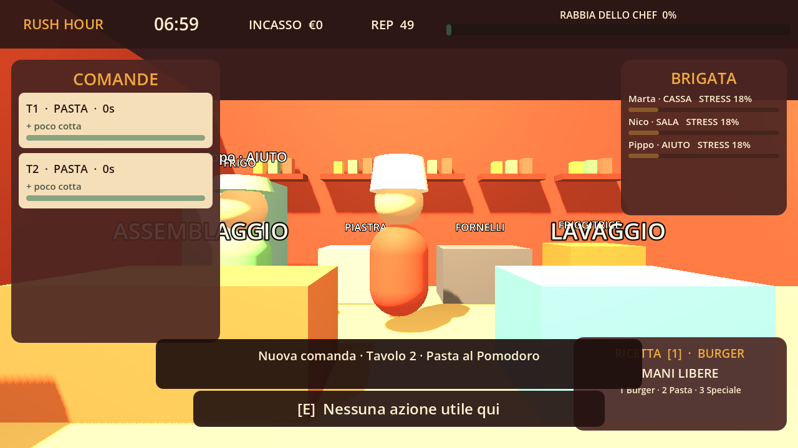

# DeGustibus: Rush Hour

Vertical slice 3D giocabile di un gestionale d'azione in terza persona ambientato in un ristorante. Il turno unisce prep fisica, briefing limitato, produzione di tre ricette, gestione indiretta della brigata, clienti e interruzioni sistemiche, punto di rottura slapstick, riepilogo e debriefing.



## Avvio rapido

Requisiti per il progetto sorgente: **Godot 4.7 stable** standard (GDScript, non .NET).

1. Aprire questa cartella nell'editor Godot e premere `F6`/`F5`, oppure eseguire `./RUN_DEMO.ps1` da PowerShell.
2. Per la build portabile inclusa, avviare `build/DeGustibus_Rush_Hour.exe`.
3. Risoluzione di riferimento: 1280×720. Renderer: Compatibility/OpenGL 3.3.

Il launcher cerca Godot tramite `GODOT4`, installazione in `PATH` o toolchain locale di sviluppo.

## Controlli

| Comando | Azione |
|---|---|
| `WASD` / frecce | Movimento dello chef |
| Mouse | Rotazione camera |
| `Shift` | Corsa leggera |
| `E` | Interazione contestuale |
| `Q` | Annulla interazione lunga |
| `1`, `2`, `3` | Seleziona Burger, Pasta, Speciale |
| Click sinistro / `Spazio` | Azione slapstick durante il breakdown |
| `Invio` | Termina prima la prep fisica |
| `Esc` | Pausa, audio, sottotitoli e sensibilità camera |

## Ciclo della demo

1. Menu principale e scelta fra prep breve, standard e lunga.
2. Prep fisica di 45 secondi: il frigo crea mise en place; lavaggio e postazioni permettono controllo/riordino.
3. Briefing: massimo tre direttive, con informazione volutamente incompleta.
4. Rush hour di sette minuti con comande, pazienza, errori del personale, disordine e stress.
5. Quattro interruzioni fisiche alla cassa, inclusa l'opportunità catering.
6. Eventuale punto di rottura: espellere tre bersagli rossi, evitando clienti tranquilli.
7. Riepilogo economico/gestionale e debriefing su un episodio della brigata.

Per cucinare, selezionare una ricetta e seguire il flusso delle postazioni:

- Burger: Frigo → Piastra → Friggitrice → Assemblaggio → Pass.
- Pasta: Frigo → Fornelli → Assemblaggio → Pass.
- Pollo croccante: Frigo → Friggitrice → Assemblaggio → Pass.

## Sistemi implementati

- Controller third-person reattivo, camera orbitale, corsa, focus e prompt contestuale.
- Ristorante 3D unico con cucina, porta fisica, sala, cassa, attesa, sei tavoli e oggetti di scena procedurali.
- Tre ricette complete con stati trasportati, timing, qualità, decadimento, rischio di spreco e valore economico.
- Comande ordinate per anzianità con tavolo, modifica, validità, responsabile, pazienza e stato.
- Prep, briefing a capacità limitata e distinzione fra quantità speciale reale, stimata, comunicata e promessa.
- Tre dipendenti fisici con statistiche differenti, percorsi, stress, umore, memoria, apprendimento e Ordine realmente simulato.
- Debito operativo visibile per postazione: clutter progressivo, rallentamento, errori/stress e reset temporizzato.
- Cinque archetipi di cliente e quattro interruzioni fisiche: catering, richieste progressive, cambio, “non siamo graditi”.
- Rabbia progressiva con bonus/penalità, drop ad alta rabbia e modalità slapstick non cruenta con penalità per bersagli errati.
- Audio musicale e feedback sonori generati a runtime, intensità dinamica e sottotitoli contestuali.
- Menu, prep, briefing, HUD, ordini, personale, rabbia, pausa/impostazioni, riepilogo e debriefing.
- Salvataggio locale in `user://rush_hour_save.cfg`: record, reputazione, catering, apprendimento e impostazioni.

## Architettura

Il progetto mantiene dati e responsabilità separati:

- `GameData`: ricette, prep, staff, clienti, eventi e direttive configurabili.
- `SessionState`: fase, economia, responsabilità, statistiche di turno e persistenza.
- `OrderManager`: generazione, priorità, pazienza, consegna e fallimento delle comande.
- `WorldBuilder`: composizione procedurale del ristorante 3D.
- `PlayerController`: movimento, camera, ricerca dell'interagibile e input.
- `KitchenStation`: disordine, efficienza, feedback visivo e dispatch delle interazioni.
- `StaffAgent` / `CustomerAgent`: presenza fisica, leggibilità e comportamento locale.
- `UIManager`: tutte le schermate e l'HUD, senza pannelli debug nella partita.
- `ProceduralAudio`: musica adattiva e cue senza asset audio esterni.
- `main.gd`: orchestrazione delle fasi e collegamento fra sistemi.

## Test

Da PowerShell:

```powershell
./scripts/test_project.ps1
```

Lo script esegue import/compilazione headless e uno smoke test deterministico del ciclo verticale: tutte le ricette, quattro interruzioni, catering, riepilogo e debriefing. Esito atteso:

```text
SMOKE PASS | recipes=3 interruptions=4 catering=yes summary=yes debrief=yes
```

## Limiti noti e placeholder

- Geometrie, personaggi e animazioni sono procedurali/cartoon: non usano un pacchetto artistico definitivo.
- I dipendenti seguono route operative leggibili, non una navigazione con avoidance completa.
- Il dialogo catering produce un contratto futuro nel salvataggio e nel summary; il livello catering non fa parte della slice.
- Le modifiche ordine influenzano filtraggio, rabbia ed economia, ma non generano varianti visive separate del piatto.
- Il lancio slapstick è una tween fisica esagerata e non una simulazione ragdoll articolata.
- Il remapping è presentato come configurazione comandi leggibile; il rebinding interattivo completo è un'estensione prevista.

## Estensione consigliata

Per una produzione completa: convertire le tabelle di `GameData` in `Resource` editabili; introdurre NavigationAgent3D e behavior tree per sala/brigata; separare inventario per contenitore; aggiungere animazioni scheletriche e VFX; costruire strumenti di authoring per giornate/eventi; aggiungere test di bilanciamento Monte Carlo; implementare calendario catering, turni e layout persistente.

## Asset, dipendenze e licenze

- Codice del progetto: licenza MIT, vedi `LICENSE`.
- Engine: Godot 4.7 stable, licenza MIT. La build portabile include il runtime Godot non modificato.
- Nessun asset, font, texture, modello o audio di terze parti. Materiali, mesh, UI e audio sono generati dal progetto.
